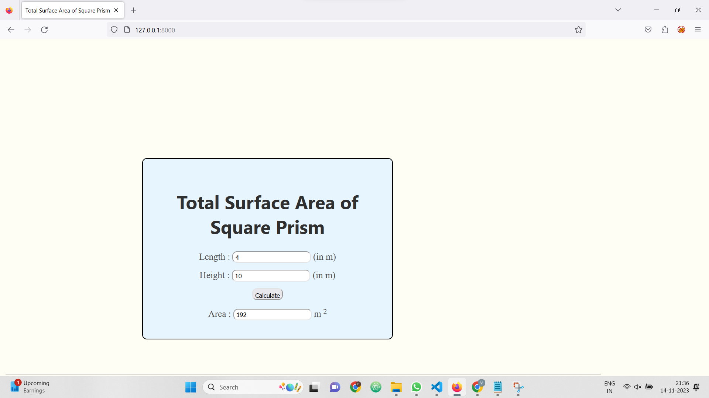

# Ex.05 Design a Website for Server Side Processing
## Date:
14.11.2023

## AIM:
To design a website to find total surface area of a square prism in server side.

## FORMULA:
Total Surface Area = 2b<sup>2</sup> + 4bh
<br>b --> Base of Square Prism
<br>h --> Height of Square Prism

## DESIGN STEPS:

### Step 1:
Clone the repository from GitHub.

### Step 2:
Create Django Admin project.

### Step 3:
Create a New App under the Django Admin project.

### Step 4:
Create python programs for views and urls to perform server side processing.

### Step 5:
Create a HTML file to implement form based input and output.

### Step 6:
Publish the website in the given URL.

## PROGRAM :
### index.html
```
<html>
<head>
<meta charset='utf-8'>
<meta http-equiv='X-UA-Compatible' content='IE=edge'>
<title>Total Surface Area of Square Prism</title>
<meta name='viewport' content='width=device-width, initial-scale=1'>
<style type="text/css">
body 
{
background-color:rgb(255, 254, 245);
}
.edge {
width: 1440px;
margin-left: auto;
margin-right: auto;
padding-top: 250px;
padding-left: 300px;
}
.box {
display:block;
border: 2px solid black;
width: 500px;
min-height: 350px;
font-size: 20px;
padding: 20px;
border-radius: 10px;
background-color:rgb(231, 245, 255);
}
.formelt{
color:rgb(84, 84, 84);
text-align: center;
margin-top: 15px;
margin-bottom: 6px;

}
.formelt input{
    border-radius: 10px;
    height: 25px;
    padding: 5px;
}
h1
{
color:rgb(48, 48, 48);
text-align: center;
font-family: 'Segoe UI', Tahoma, Geneva, Verdana, sans-serif;
padding-top: 20px;
}
</style>
</head>
<body>
<div class="edge">
<div class="box">
<h1>Total Surface Area of Square Prism</h1>
<form method="POST">

<div class="formelt">
Length : <input type="text" name="length" value="{{l}}"></input> (in m)<br/>
</div>
<div class="formelt">
Height : <input type="text" name="breadth" value="{{b}}"></input>  (in m)<br/>
</div>
<div class="formelt">
<input type="submit" value="Calculate"></input><br/>
</div>
<div class="formelt">
Area : <input type="text" name="area" value="{{area}}"></input> m<sup> 2</sup><br/>
</div>
</form>
</div>
</div>
</body>
</html>
```
### views.py
```

from django.shortcuts import render
def rectarea(request):
    context={}
    context['area'] = "0"
    context['l'] = "0"
    context['b'] = "0"
    if request.method == 'POST':
        print("POST method is used")
        l = request.POST.get('length','0')
        b = request.POST.get('breadth','0')
        print('request=',request)
        print('Length=',l)
        print('Breadth=',b)
        area = 2*(int(l)**2) + 4*int(l)*int(b)
        context['area'] = area
        context['l'] = l
        context['b'] = b
        print('Area=',area)
    return render(request,'area/index.html',context)
```
### urls.py
```
from django.contrib import admin
from django.urls import path
from area import views

urlpatterns = [
    path('admin/', admin.site.urls),
    path('areaofrectangle/',views.rectarea,name="areaofrectangle"),
    path('',views.rectarea,name="areaofrectangleroot")
]
```
## OUTPUT:



## RESULT:
The program for performing server side processing is completed successfully.
